# Execution Plan

## Detailed Analysis Summary

### Change Impact Assessment

- **User-facing changes**: Yes. SPA-Bridge exposes both CLI and Web UI workflows for conversion, review, reporting, and remediation.
- **Structural changes**: Yes. The product requires source analyzers, an intermediate representation, mapping/rule engines, LLM providers, target generators, quality gates, reporting, and shared application services.
- **Data model changes**: Yes. New internal models are needed for parsed Angular artifacts, dependency graphs, intermediate representation, conversion runs, masking tokens, diagnostics, quality results, and reports.
- **API changes**: Yes. CLI commands, Web UI/API boundaries, provider interfaces, plugin-friendly extension interfaces, and report schemas must be designed.
- **NFR impact**: Yes. Security, privacy, performance, scalability, observability, supply chain integrity, and property-based testing constraints apply.

### Risk Assessment

- **Risk Level**: High
- **Rollback Complexity**: Moderate. Greenfield code can be changed freely, but architecture decisions will affect many downstream units.
- **Testing Complexity**: Complex. The system needs parser fixtures, conversion snapshots, example-based tests, property-based tests, quality gate tests, security checks, and end-to-end sample project validation.

### Key Drivers

- Full MVP scope includes Angular 15+ to React 18+ conversion, routing, state management, DI/lifecycle mapping, boilerplate generation, LLM refinement, masking, self-correction, and reporting.
- Security Baseline and Property-Based Testing are enabled as full blocking extensions.
- The project must preserve plugin-friendly internal boundaries while initially focusing on Angular to React.
- Both CLI and Web UI must share a core conversion engine.

## Workflow Visualization

### Mermaid Diagram

```mermaid
flowchart TD
    Start(["User Request"])

    subgraph INCEPTION["INCEPTION PHASE"]
        WD["Workspace Detection<br/><b>COMPLETED</b>"]
        RE["Reverse Engineering<br/><b>SKIP</b>"]
        RA["Requirements Analysis<br/><b>COMPLETED</b>"]
        US["User Stories<br/><b>COMPLETED</b>"]
        WP["Workflow Planning<br/><b>IN REVIEW</b>"]
        AD["Application Design<br/><b>EXECUTE</b>"]
        UG["Units Generation<br/><b>EXECUTE</b>"]
    end

    subgraph CONSTRUCTION["CONSTRUCTION PHASE"]
        FD["Functional Design<br/><b>EXECUTE</b>"]
        NFRA["NFR Requirements<br/><b>EXECUTE</b>"]
        NFRD["NFR Design<br/><b>EXECUTE</b>"]
        ID["Infrastructure Design<br/><b>SKIP</b>"]
        CG["Code Generation<br/><b>EXECUTE</b>"]
        BT["Build and Test<br/><b>EXECUTE</b>"]
    end

    subgraph OPERATIONS["OPERATIONS PHASE"]
        OPS["Operations<br/><b>PLACEHOLDER</b>"]
    end

    Start --> WD
    WD --> RE
    RE --> RA
    RA --> US
    US --> WP
    WP --> AD
    AD --> UG
    UG --> FD
    FD --> NFRA
    NFRA --> NFRD
    NFRD --> ID
    ID --> CG
    CG --> BT
    BT --> OPS
    OPS --> End(["Complete"])

    style WD fill:#4CAF50,stroke:#1B5E20,stroke-width:3px,color:#fff
    style RA fill:#4CAF50,stroke:#1B5E20,stroke-width:3px,color:#fff
    style US fill:#4CAF50,stroke:#1B5E20,stroke-width:3px,color:#fff
    style WP fill:#FFA726,stroke:#E65100,stroke-width:3px,stroke-dasharray: 5 5,color:#000
    style AD fill:#FFA726,stroke:#E65100,stroke-width:3px,stroke-dasharray: 5 5,color:#000
    style UG fill:#FFA726,stroke:#E65100,stroke-width:3px,stroke-dasharray: 5 5,color:#000
    style FD fill:#FFA726,stroke:#E65100,stroke-width:3px,stroke-dasharray: 5 5,color:#000
    style NFRA fill:#FFA726,stroke:#E65100,stroke-width:3px,stroke-dasharray: 5 5,color:#000
    style NFRD fill:#FFA726,stroke:#E65100,stroke-width:3px,stroke-dasharray: 5 5,color:#000
    style CG fill:#FFA726,stroke:#E65100,stroke-width:3px,stroke-dasharray: 5 5,color:#000
    style BT fill:#FFA726,stroke:#E65100,stroke-width:3px,stroke-dasharray: 5 5,color:#000
    style RE fill:#BDBDBD,stroke:#424242,stroke-width:2px,stroke-dasharray: 5 5,color:#000
    style ID fill:#BDBDBD,stroke:#424242,stroke-width:2px,stroke-dasharray: 5 5,color:#000
    style OPS fill:#BDBDBD,stroke:#424242,stroke-width:2px,stroke-dasharray: 5 5,color:#000
    style Start fill:#CE93D8,stroke:#6A1B9A,stroke-width:3px,color:#000
    style End fill:#CE93D8,stroke:#6A1B9A,stroke-width:3px,color:#000
    style INCEPTION fill:#BBDEFB,stroke:#1565C0,stroke-width:3px,color:#000
    style CONSTRUCTION fill:#C8E6C9,stroke:#2E7D32,stroke-width:3px,color:#000
    style OPERATIONS fill:#FFF59D,stroke:#F57F17,stroke-width:3px,color:#000
    linkStyle default stroke:#333,stroke-width:2px
```

### Text Alternative

- INCEPTION: Workspace Detection completed, Reverse Engineering skipped, Requirements Analysis completed, User Stories completed, Workflow Planning in review.
- INCEPTION next: Application Design execute, Units Generation execute.
- CONSTRUCTION: Functional Design execute, NFR Requirements execute, NFR Design execute, Infrastructure Design skip, Code Generation execute, Build and Test execute.
- OPERATIONS: Placeholder.

## Phases to Execute

### INCEPTION PHASE

- [x] Workspace Detection - COMPLETED
  - **Rationale**: Required. Greenfield project detected.
- [x] Reverse Engineering - SKIPPED
  - **Rationale**: No existing codebase was detected.
- [x] Requirements Analysis - COMPLETED
  - **Rationale**: Required. Comprehensive requirements were generated from root `requirements.md` and user answers.
- [x] User Stories - COMPLETED
  - **Rationale**: Required by product complexity, multiple personas, and user-facing CLI/Web UI workflows.
- [x] Workflow Planning - IN REVIEW
  - **Rationale**: Required. This plan defines the recommended execution path.
- [ ] Application Design - EXECUTE
  - **Rationale**: New components, service boundaries, provider abstractions, conversion pipeline, reporting, and shared CLI/Web UI core need definition.
- [ ] Units Generation - EXECUTE
  - **Rationale**: The product requires multiple units of work across parsing, IR, mapping, AI refinement, target generation, masking, quality gates, reporting, CLI, and Web UI.

### CONSTRUCTION PHASE

- [ ] Functional Design - EXECUTE
  - **Rationale**: Complex business logic exists in AST parsing, IR normalization, mapping rules, masking, provider selection, self-correction, and quality evaluation.
- [ ] NFR Requirements - EXECUTE
  - **Rationale**: Security, privacy, performance, extensibility, observability, supply chain, and PBT requirements need per-unit assessment and tech-stack decisions.
- [ ] NFR Design - EXECUTE
  - **Rationale**: Enabled Security Baseline and PBT rules require concrete patterns before code generation.
- [ ] Infrastructure Design - SKIP
  - **Rationale**: Current approved requirements do not define cloud resources, deployment architecture, persistence stores, network intermediaries, or infrastructure services. This can be added if deployment architecture becomes in-scope.
- [ ] Code Generation - EXECUTE
  - **Rationale**: Required for implementation planning and code generation per unit.
- [ ] Build and Test - EXECUTE
  - **Rationale**: Required for build instructions, unit tests, integration tests, PBT, security checks, and quality gate validation.

### OPERATIONS PHASE

- [ ] Operations - PLACEHOLDER
  - **Rationale**: AIDLC Operations is currently a placeholder. Build and test activities remain in Construction.

## Recommended Future Unit Themes

The exact units will be produced during Units Generation, but Workflow Planning expects these likely unit groups:

1. Project configuration, CLI, and shared run orchestration.
2. Source scanning, dependency graph, and Angular parser.
3. Intermediate representation and traceability model.
4. Component/template/binding/lifecycle conversion rules.
5. Routing, DI, service, and state conversion.
6. LLM provider abstraction and local/internal provider integration.
7. Sensitive information masking and restoration.
8. Target React project generation.
9. Self-correction, quality gates, and PBT framework integration.
10. Conversion reporting and Web UI review workflow.
11. Security, logging, supply chain, and governance controls.

## Estimated Timeline

- **Recommended remaining stages before Construction**: 2
- **Recommended Construction stages**: 5
- **Estimated Duration**: High-complexity multi-stage build. Duration should be refined after Units Generation.

## Success Criteria

- **Primary Goal**: Generate a secure, extensible SPA-Bridge implementation plan and codebase for Angular 15+ to React 18+ conversion.
- **Key Deliverables**:
  - Application design artifacts.
  - Unit breakdown and dependency map.
  - Per-unit functional and NFR designs.
  - Generated application code in the workspace root.
  - Tests and build/test instructions.
- **Quality Gates**:
  - TypeScript compilation.
  - ESLint and Prettier checks.
  - Example-based unit and integration tests.
  - Property-based tests with seed logging.
  - Sample Angular project conversion and React build validation where available.
  - Security checks for input validation, masking, logging, dependency scanning, and fail-closed behavior.

## Extension Compliance Summary

### Security Baseline

| Rule | Status | Rationale |
|---|---|---|
| SECURITY-01 | N/A | No persistence store or infrastructure resources are planned at this stage. |
| SECURITY-02 | N/A | Network intermediaries are not planned at this stage. |
| SECURITY-03 | Compliant | NFR Requirements and NFR Design are planned to define structured logging and sensitive-data exclusion. |
| SECURITY-04 | N/A | Applies later if Web UI serving endpoints are designed. |
| SECURITY-05 | Compliant | Functional Design and Code Generation are planned for CLI/Web UI/API input validation. |
| SECURITY-06 | N/A | IAM/access policies are out of scope unless infrastructure is added. |
| SECURITY-07 | N/A | Network configuration is out of scope unless infrastructure is added. |
| SECURITY-08 | Compliant | NFR stages are planned to determine Web UI/API access control requirements. |
| SECURITY-09 | Compliant | NFR Design and Code Generation are planned for hardening and safe error handling. |
| SECURITY-10 | Compliant | NFR Requirements and Build/Test are planned for dependency pinning, vulnerability scanning, SBOM, and CI/CD integrity. |
| SECURITY-11 | Compliant | Application Design and NFR Design are planned to cover secure design and abuse scenarios. |
| SECURITY-12 | N/A | Authentication is not yet confirmed; applies if Web UI auth is included. |
| SECURITY-13 | Compliant | Application Design and NFR Design are planned for safe deserialization, provider/plugin integrity, and auditability. |
| SECURITY-14 | Compliant | NFR Design and Build/Test are planned for monitoring, alerting, and log integrity requirements. |
| SECURITY-15 | Compliant | Functional Design and Code Generation are planned for fail-closed error handling. |

### Property-Based Testing

| Rule | Status | Rationale |
|---|---|---|
| PBT-01 | Compliant | Functional Design is planned and must identify testable properties per unit. |
| PBT-02 | Compliant | Units likely include masking, IR serialization, parsing/formatting, and report serialization round-trips. |
| PBT-03 | Compliant | Mapping and graph/IR invariants are planned for Functional Design and Code Generation. |
| PBT-04 | Compliant | Configuration normalization and formatting idempotence are planned candidates. |
| PBT-05 | Compliant | Oracle/model tests are planned where deterministic rules or fixtures can provide reference behavior. |
| PBT-06 | Compliant | Stateful components will be evaluated during Functional Design. |
| PBT-07 | Compliant | Code Generation planning must include domain-specific generators. |
| PBT-08 | Compliant | Build and Test is planned to include seed logging and reproducibility. |
| PBT-09 | Compliant | NFR Requirements is planned to finalize PBT framework selection. |
| PBT-10 | Compliant | Build and Test is planned to include both example-based and property-based tests. |

## Content Validation Summary

- Mermaid node IDs use alphanumeric identifiers only.
- Mermaid labels avoid unescaped quotes.
- A text alternative is included for the workflow visualization.
- No ASCII diagrams are included.
- Markdown tables and code blocks were checked for parsing compatibility.

